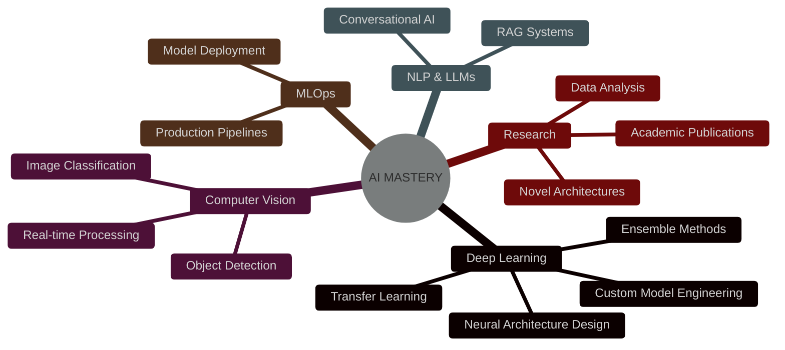

<div align="center">


  [](https://git.io/typing-svg)
  
<p align="center">
  
  
  
  
</p>

</br>
  
</div>

</br>

</div>

<table align="center">
<tr>
<td width="40%">

### 🎯 **Core Identity**
```yaml
name: "Aayush Chauhan"
location: "Noida, India"
education: 
  degree: "B.Tech ECE + AI/ML Minor"
  university: "University of Delhi"
  graduation: "May 2027"
status: "Building Tomorrow's AI"
philosophy: |
  Code with purpose,
  Learn without limits,
  Impact through innovation
```

</td>
<td width="60%">

### ⚡ **Power Level Assessment**

```python
class StudentDeveloper:
    def __init__(self):
        self.neural_networks = "🧠 Learning"
        self.computer_vision = "👁️ Developing"
        self.nlp_expertise = "📝 Exploring"
        self.mlops_skills = "🏗️ Building"
        self.research_interest = "🔬 Growing"

    def __str__(self):
        return "🌱 Aspiring ML Engineer"

# My current journey
me = StudentDeveloper()
print(f"Status: {me}"))
```

</td>
</tr>
</table>

</br>

## 🛡️ Arsenal of Technologies

<div align="center">

### ⚔️ **Legendary Weapons**

<table>
<tr>
<td align="center">

</td>
<td align="center">

</td>
<td align="center">

</td>
</tr>
</table>

### 🧙‍♂️ **Mystical AI Arts**


| **🏷️ Category** | **⚡ Technologies** |
|:---:|:---|
| **🧠 Core AI/ML** |     |
| **👁️ Vision Magic** |     |
| **🔮 LLM Arsenal** |     |
| **📊 Data Mastery** |     |
| **🚀 Deployment** |     |
| **⚡ Power Tools** |     |

</details>

</div>

</br>

## 🌟 Domains of Mastery

<div align="center">



</div>
</br>

## 📊 Digital Performance Matrix

<div align="center">


<table>
<tr>
<td width="50%">


</td>
<td width="50%">


</td>
</tr>
</table>


</div>


## 🌐 Connect to the Network

<div align="center">


### 🚀 **Transmission Channels**

<table>
<tr>
<td align="center">
<a href="https://linkedin.com/in/aayushchauhan019">

</a><br/>
</td>
<td align="center">
<a href="https://github.com/aayush010904">

</a><br/>
</td>
<td align="center">
<a href="https://aayush-portfolio-plum.vercel.app">

</a><br/>
</td>
<td align="center">
<a href="mailto:aayushchauhan019@gmail.com">

</a><br/>
</td>
</tr>
</table>

### 💌 **Open Communication Protocols**


</div>


<div align="center">

### 🌟 *"The future belongs to those who believe in the beauty of their algorithms"* 


**🎯 Ready to collaborate on the next breakthrough?**


</div>
